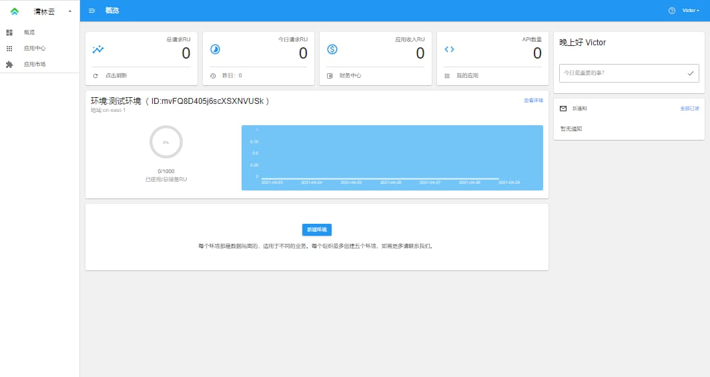
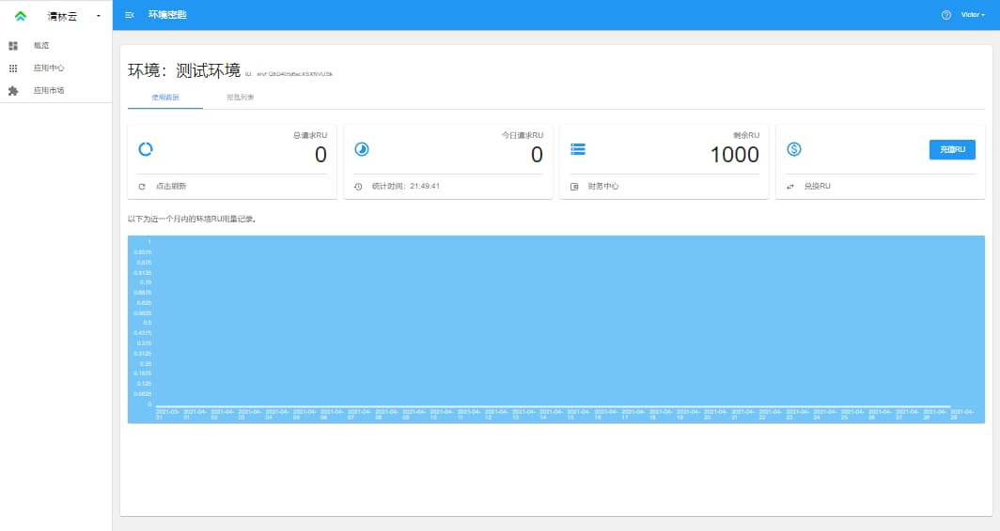
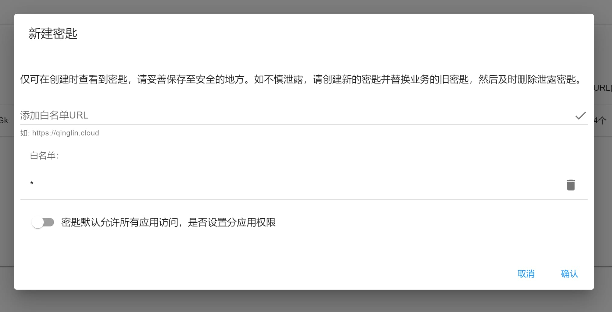
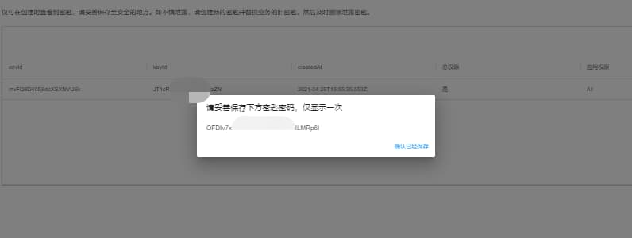
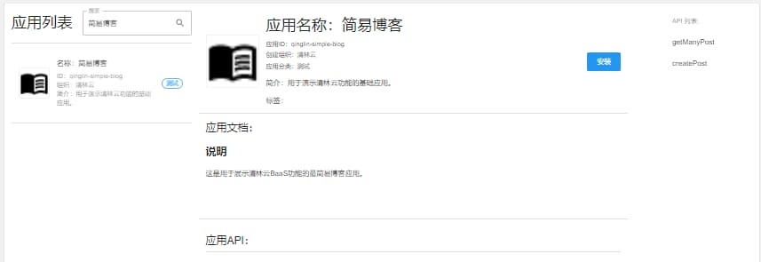
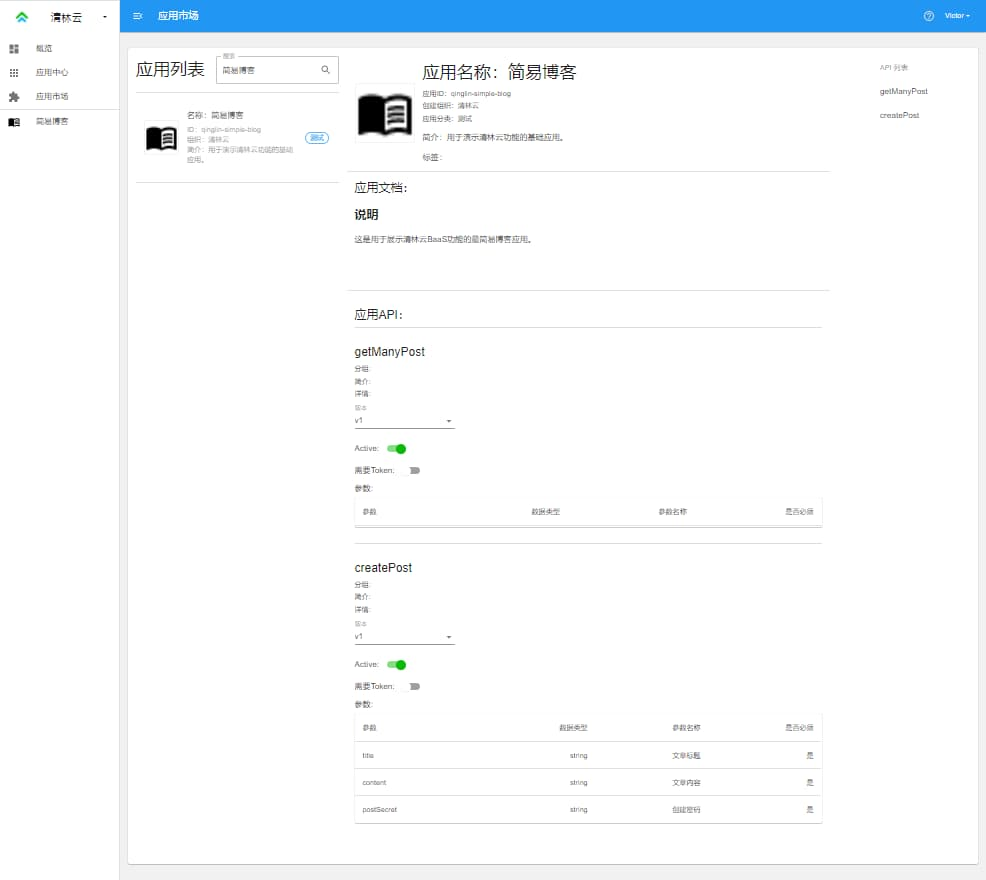
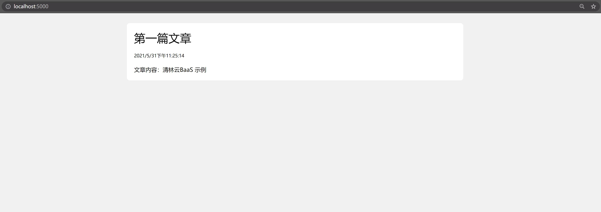
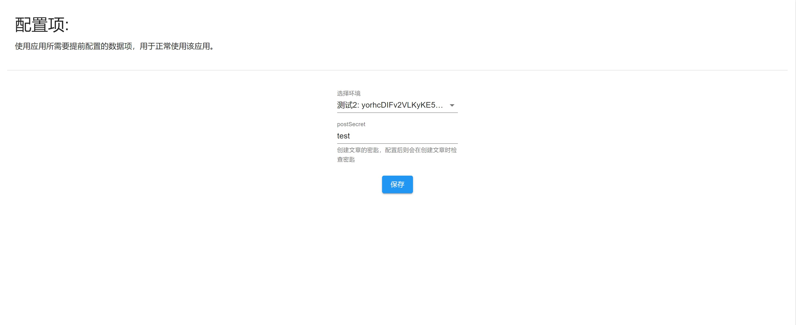
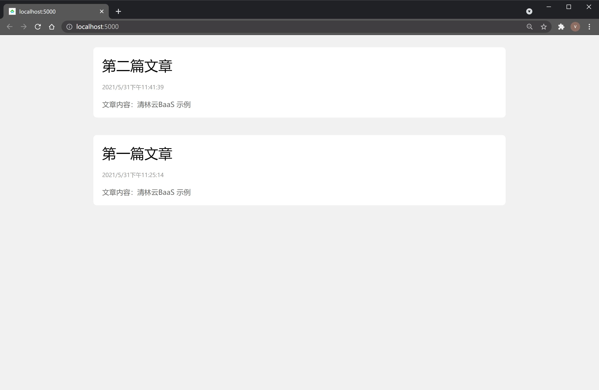
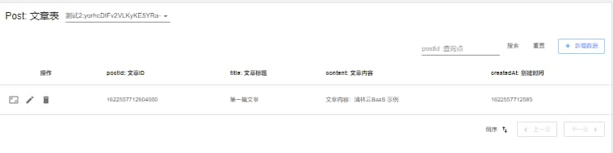

# 清林云BaaS 快速开始示例

在快速开始示例中，我们将使用清林云 BaaS (Backend as a Service) 云服务和各种前端语言框架创建一个简单的博客系统。

本章节要求你至少熟悉 JavaScript 语言和开发网页的基础知识，如果你是零基础，可以先前往清林云学院学习[零基础编程课程]。

本章节假设你还未注册清林云，已注册的用户可以跳过第一部分。

## 1. 获取环境密匙

请点击右上角“控制台”按钮打开清林云控制台登录页面，扫描小程序码后注册登录。

当你在手机端完成验证后，网页端会自动跳转到控制台界面，如果你没有组织，则会创建一个“默认组织”和对应地域的一个“默认环境”。

“组织”是清林云管理环境、成员、权限的基本单位，类似于公司或团队的概念。

“环境”是使用 BaaS 的基本单位，你可以理解为一个环境就是一套独立的服务器数据库机房。就好比说微信和淘宝分别是两个环境，他们的数据互相隔离，但是天猫和淘宝可以共用一个环境。

> 新环境免费赠送 1000RU 的资源可以直接使用，后面当你需要支付获取更多 RU 时需要实名认证才可以（依据网络安全相关规定）。

> 地域决定了这个环境部署在哪个物理地区位置，不可更改。比如“cn-east-1”是中国华东地区的机房。如需开通多地域请联系客服。



点击该环境的右上角“查看详情”进入到该环境的详情界面。



点击选项卡的“环境密匙”切换到环境密匙界面。


现在我们来创建一个，点击“新建密匙”，先不管“白名单”和“分应用权限”，直接点击“确认即可”。默认的`*`为允许所有来源的请求，上线产品后需要更改为你的业务域名。



此时界面上会出现这个密匙的密码 secret，复制它放到备忘录或记事本保存。

> 环境密匙分为两部分，keyId 和 secret。keyId 是当前端请求 BaaS 时需要携带的信息，用来判定到底用哪一个密匙去解密 token 或加密 token。

> 注：A 密匙加密的 token 无法用 B 密匙解密，如果不是泄露了密匙需要更换，请尽量不要创建多个密匙，容易混乱。

> secret 只在创建时能看到一次，请在创建密匙时妥善保存。该密文可以鉴权用户 token，也可以访问云数据库 API。



好的，现在我们已经有了最基础的密匙信息，拿着环境 ID 和该密匙的 keyId 前往下一步。

## 2. 安装简易博客应用

点击左侧栏“应用市场”前往应用中心。

在搜索栏输入“简易博客”。可以看到出现了《简易博客》应用。点击该应用查看详情。



点击“安装”按钮就将该应用安装到了我们的组织中。现在就可以使用它的 API 了。再往下方继续浏览，查看应用的介绍和 API。



好的，我们现在已经安装好了“简易博客”应用，进入下一步写一个小网页来使用它吧。

## 3. 开发博客网页

### 简易示例

此处我们用 html 和 react 简单写一个小页面。

如果你的浏览器支持，则可以看到下方的在线编辑器，点击“Run Project”：(小程序用户请到 PC 端打开)

<iframe width="100%" height="600px" max-height="100%" src='https://stackblitz.com/edit/qinglin-quickstart?ctl=1&devtoolsheight=33&embed=1&file=index.html&hideNavigation=1'></iframe>

该在线编辑器(不支持 Safari 和小程序端)使用了：[Web Container(https://stackblitz.com/fork/qinglin-quickstart)]，你也可以前往自行编辑，打开后修改环境信息即可看到效果。

React 示例：[React quickstart(https://stackblitz.com/fork/qinglin-quickstart-react)]

Vue 示例：[Vue quickstart(https://stackblitz.com/fork/qinglin-quickstart-vue)]

Angular 示例：[Angular quickstart(https://stackblitz.com/fork/qinglin-quickstart-angular)]

如果浏览器不支持或想尝试本地编辑，则请自行创建一个`index.html`文件，然后复制下方代码进去后保存并用浏览器打开:

```html
<html>
  <head>
    <script src="https://unpkg.com/react@latest/umd/react.development.js"></script>
    <script src="https://unpkg.com/react-dom@latest/umd/react-dom.development.js"></script>
    <script src="https://unpkg.com/@babel/standalone@latest/babel.js"></script>
    <style>
      body {
        background-color: #f1f1f1;
      }
      .container {
        display: flex;
        flex-direction: column;
        align-items: center;
      }
      .post {
        background-color: #fff;
        border-radius: 8px;
        margin: 20px;
        padding: 20px;
        width: 900px;
        max-width: 90%;
      }
      .postTitle {
        font-size: 2em;
      }
      .postTime {
        font-size: 0.8em;
        color: #999;
        margin: 20px auto;
      }
      .postContent {
        color: #666;
      }
      .noContent {
        margin: 20%;
      }
    </style>
  </head>
  <body>
    <div id="root"></div>
    <script type="text/babel">
      function Page() {
        const [posts, setPosts] = React.useState([]);

        React.useEffect(() => {
          fetch('https://cn-east-1.baasapi.com/', {
            headers: {
              envid: 'yorhcDIFv2VLKyKE5YRa-', // 替换为你的环境ID
              keyid: 'frDo9pCfewCfBQ93otisA', // 替换为上面环境的密匙ID
            },
            method: 'POST',
            body: JSON.stringify({
              appId: 'qinglin-simple-blog', // 应用ID
              api: 'getManyPost', // 应用API
              version: 'v1', // API版本
              args: {}, // API参数
            }),
          })
            .then((res) => res.json())
            .then((data) => {
              console.log(data);
              setPosts(data.posts ? data.posts.data : []);
            })
            .catch((e) => console.error(e));
        }, []);

        return (
          <div className='container'>
            {posts.length > 0 ? (
              posts.map((item, key) => (
                <div className='post' key={key}>
                  <div className='postTitle'>{item.title}</div>
                  <div className='postTime'>
                    {new Date(item.createdAt).toLocaleString()}
                  </div>
                  <div className='postContent'>{item.content}</div>
                </div>
              ))
            ) : (
              <div className='noContent'>没有文章</div>
            )}
          </div>
        );
      }

      ReactDOM.render(<Page />, document.getElementById('root'));
    </script>
  </body>
</html>
```

不出意外的话你已经可以看到一个空白网页了，你的环境中暂时没有文章，我们查看下一节，尝试调用`createPost`去创建文章。

<!-- ### 多框架示例

正在编辑中...

在应用详情的上方有个“代码示例”，点击跳转可以看到博客网页的示例代码库。

现在打开你常用的代码编辑器，在终端输入：

```bash
git clone
```

下载好代码库后进入，切换你常用的语言和框架，默认是 JavaScript 和 react。

```bash
# react
# vue
# html
# angular
# flutter
# android
# ios
git checkout react
```

然后安装相应依赖：

安装好依赖后替换`config.json`文件中的配置，将环境 ID 和密匙 ID 替换为第一个步骤得到的：

现在我们启动项目。如果没有问题的话，会看到空界面，因为我们目前还没有博客数据：

下面我们来熟悉清林云 BaaS 的 API 通用格式并创建一些博客文章数据。 -->

## 4. 请求格式

在项目的代码中我们可以发现有地址为`https://环境地域.baasapi.com`的网络请求，这就是“简易博客”应用的一些相关 API。

API 的基本结构如下，以浏览器的 fetch 请求为例：

```
// 将以下环境地域、环境ID、环境密匙ID替换为实际信息
fetch("https://环境地域.baasapi.com/", {
  "headers": {
    "content-type": "application/json",
    "envid": "你的环境ID",
    "keyid": "你的环境密匙ID",
  },
  "method": "POST",
  "body": JSON.stringify({
    appId: "qinglin-simple-blog",
    api: "createPost",
    version: "v1",
    args: {
      title: "第一篇文章",
      content: "文章内容：清林云BaaS 示例",
    }
  })
})
.then(res=>res.json())
.then(data=>console.log(data))
.catch(e=>console.log(e))
```

这是清林云的 API 约束，我们称之为 TypeAPI ，在很多场景下描述能力优于 RESTful 风格，开发者更容易理解。

所有的请求都是`POST`类型，`URL`固定为环境地域的地址，`body`内包括`api`,`appId`,`version`(api 的版本号),和`args`内的所有自定义数据。

返回内容都是 JSON 格式，有两种：

成功：

```json
{
  "步骤ID": "数据"
}
```

失败：

```json
{
  "errCode": "错误码",
  "type": "错误的API",
  "title": "错误原因",
  "detail": "详细数据",
  "instance": "请求ID和客户端数据"
}
```

更详细的 API 结构请查看[API 格式](https://www.baasapi.com/docs/api)章节。

## 5. 存取数据

好的，现在让我们对照“简易博客”的 API 文档测试一下请求，为了最简单，此处我们按 F12 使用浏览器开发者工具即可，当然你也可以用自己习惯的 API 调试工具，注意替换环境信息：

```
// 将以下环境地域、环境ID、环境密匙ID替换为实际信息
fetch("https://cn-east-1.baasapi.com/", {
  "headers": {
    "content-type": "application/json",
    "envid": "yorhcDIFv2VLKyKE5YRa-",
    "keyid": "frDo9pCfewCfBQ93otisA",
  },
  "method": "POST",
  "body": JSON.stringify({
    appId: "qinglin-simple-blog",
    api: "getManyPost",
    version: "v1",
    args: {}
  })
})
.then(res=>res.json())
.then(data=>console.log(data))
.catch(e=>console.log(e))
```

返回值：

```json
{
  "posts": {
    "data": [],
    "nextId": null
  }
}
```

可以看到暂时没有文章数据，接下来我们将要往数据库中存一些文章数据：

```
// 将以下环境地域、环境ID、环境密匙ID替换为实际信息
fetch("https://cn-east-1.baasapi.com/", {
  "headers": {
    "content-type": "application/json",
    "envid": "yorhcDIFv2VLKyKE5YRa-",
    "keyid": "frDo9pCfewCfBQ93otisA",
  },
  "method": "POST",
  "body": JSON.stringify({
    appId: "qinglin-simple-blog",
    api: "createPost",
    version: "v1",
    args: {
      title: "第一篇文章",
      content: "文章内容：清林云BaaS 示例",
    }
  })
})
.then(res=>res.json())
.then(data=>console.log(data))
.catch(e=>console.log(e))
```

成功返回值：

```json
{
  "post": {
    "postId": 1622475599676000
  }
}
```

好的，现在我们就成功存入了一些文章数据，回到第三步的网页应用刷新查看，发现已经有文章了：



“简易博客”应用的创建文章接口默认不需要用户名密码，只是个示例应用。

如果想要验证身份，防止任何人都可以创建文章，我们一般需要使用“用户系统”这样的专业应用去统一给用户颁发 token 验证身份。

但是在这个示例中，我们一切从简，“简易博客”应用做了一个最简单的不完全安全的防护措施用来示例。在应用中心中找到“简易博客”，然后点击“配置”前往应用配置界面，可以看到一些配置项，我们来设置该应用的密码。



配置完成后再执行上述请求可以看到请求失败了，没有通过验证。

```
// 将以下环境地域、环境ID、环境密匙ID替换为实际信息
fetch("https://cn-east-1.baasapi.com/", {
  "headers": {
    "content-type": "application/json",
    "envid": "yorhcDIFv2VLKyKE5YRa-",
    "keyid": "frDo9pCfewCfBQ93otisA",
  },
  "method": "POST",
  "body": JSON.stringify({
    appId: "qinglin-simple-blog",
    api: "createPost",
    version: "v1",
    args: {
      title: "第二篇文章",
      content: "文章内容：清林云BaaS 示例",
    }
  })
})
.then(res=>res.json())
.then(data=>console.log(data))
.catch(e=>console.log(e))
```

失败返回值：

```json
{
  "errCode": 1,
  "title": "密码错误",
  "type": "createPost",
  "detail": "xxx",
  "instance": "xxx"
}
```

此时我们将前面配置好的密码放入请求 `args` 的 `postSecret` 中如下所示：

再次请求，发现成功了。

```
// 将以下环境地域、环境ID、环境密匙ID替换为实际信息
fetch("https://cn-east-1.baasapi.com/", {
  "headers": {
    "content-type": "application/json",
    "envid": "yorhcDIFv2VLKyKE5YRa-",
    "keyid": "frDo9pCfewCfBQ93otisA",
  },
  "method": "POST",
  "body": JSON.stringify({
    appId: "qinglin-simple-blog",
    api: "createPost",
    version: "v1",
    args: {
      title: "第二篇文章",
      content: "文章内容：清林云BaaS 示例",
      postSecret: "test",
    }
  })
})
.then(res=>res.json())
.then(data=>console.log(data))
.catch(e=>console.log(e))
```

成功返回值：

```json
{
  "post": {
    "postId": 1622485599676000
  }
}
```

刷新网页查看到新文章：



这样我们就将“简易博客”的`createPost`API 简单保护了起来，其他人仅仅只能查看文章。

另外，你也可以到清林云控制台点击左侧的应用列表中的 `简易博客` 前往该应用的数据页直接查看原始数据，进行更新、删除等操作，相当于一个通用后台。



到此处，“简易博客”应用我们已经成功运行了，相比于传统的开发后端，直接使用 BaaS 的方便性领先一个时代，而且对于越复杂的应用效果越明显。

> “简易博客”的权限只是一个简单的展示，请勿在商业产品中使用该方式保护 API。想要更完善的、和清林云同款的用户登录注册权限等应用功能和安全措施，请前往应用市场查看《用户系统 appId: user》。

> 如果你想知道这个“简易博客”应用是怎样被设计出来的，可以查看[创建应用](https://www.baasapi.com/docs/app-create)章节，快速入门设计自定义应用，所有人都可以设计更好更强大的应用。

## 6. 完成

完成产品开发后，我们将其部署，注意别忘了前往环境详情页面配置密匙白名单，减少安全隐患。如果你对部署项目不熟悉，可以前往清林云学习中心学习前端部署课程。

好的，我们已经完成了一个最基本的项目，熟悉了清林云 BaaS 的使用，能够体会到使用 BaaS 是多么的简单方便。后面你可以前往应用市场发现并安装更多的应用，用来开发你需要的产品。

如果你想了解更详细的使用方式，请查看[API 格式](https://www.baasapi.com/docs/api)章节。

如果你想学习如何设计自定义应用，请查看[自定义应用](https://www.baasapi.com/docs/app-create)目录。

我们在[最佳实践](https://www.baasapi.com/docs/bp-user)中以 `需求-功能分析-数据库结构-API-界面` 的组合用描述和截图展示了一些常见应用从零到一的设计与实现，你可以通过查看实践的方式了解到完整应用的细节，能够更好的开发自定义应用并使用。

> 本着吃自己的狗粮原则，清林云 BaaS 控制台自身就使用了最佳实践中的[用户系统](https://www.baasapi.com/docs/bp-user)和[组织系统](https://www.baasapi.com/docs/bp-org)。
